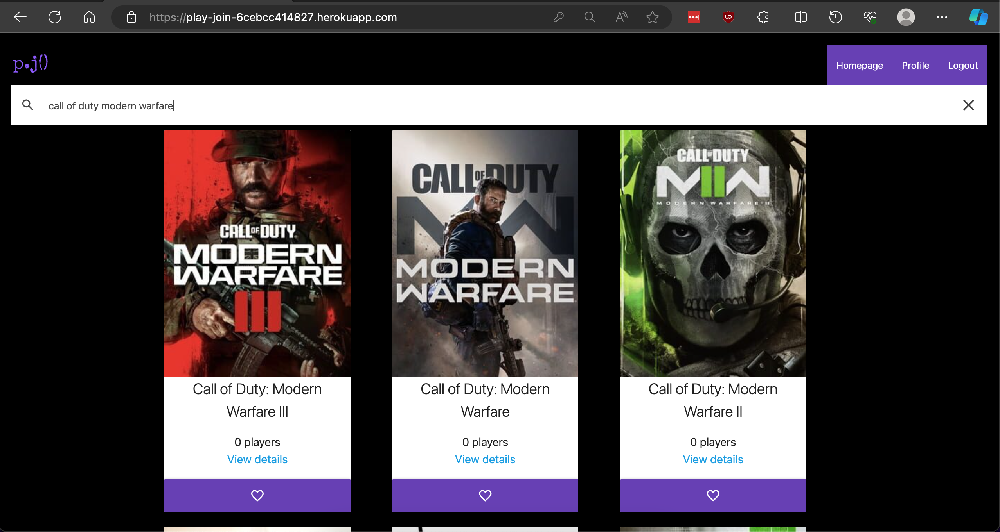
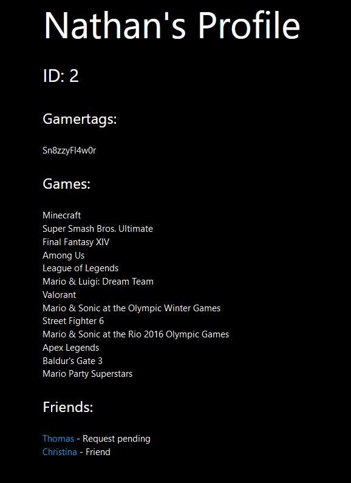

# play.join()

## Description

Introducing Play.Join(), the go-to app for gamers looking to connect and team up with fellow players. With Play.Join(), you can easily discover gaming friends who share your passion for your favorite titles. Simply create your profile, list your preferred games, and instantly find other gamers with similar interests. Connect with other gamers by adding their gamer tags and take your multiplayer adventures to the next level. Play.Join is your ticket to expanding your gaming circle and making memorable gaming experiences with like-minded players.

You can visit the website here: [play.join](https://play-join-6cebcc414827.herokuapp.com/)

## Technologies Used

|Tech|Docs|
|:-|:-:|
| Javascript | [docs](https://developer.mozilla.org/en-US/docs/Web/JavaScript) |
| CSS | [docs](https://developer.mozilla.org/en-US/docs/Web/CSS) |
| Bulma framework | [docs](https://bulma.io/documentation/) |
| Express JS | [docs](https://expressjs.com) |
| Express Handlebars | [docs](https://www.npmjs.com/package/express-handlebars) |
| Handlebars | [docs](https://handlebarsjs.com) |
| Express Session | [docs](https://expressjs.com/en/resources/middleware/session.html) |
| Sequelize v6 | [docs](https://sequelize.org/docs/v6/) |
| Bcrypt | [docs](https://www.npmjs.com/package/bcrypt) |
| Heroku | [docs](https://devcenter.heroku.com/) |
| IGDB | [docs](https://api-docs.igdb.com/#getting-started) |
| IGDB node package | [docs](https://www.npmjs.com/package/igdb-api-node) |

## User Stores

* I want to login/signup to have full access to the website

* I want to search for games to play with others

* I want to favorite a game

* I want to see other users who play the same games I do

* I want to add friends

## Models

### AccessToken

| Column | Requirements |
|--|--|
| id | Integer, not null, auto increment, primary key |
| token | String, not null |

### Friends

| Column | Requirements |
|--|--|
| id | Integer, not null, auto increment, primary key |
| user_id | Integer, references [User](#user) |
| game_id | Integer, references [Game](#game) |
| isFriend | Boolean, not null |

### Game

| Column | Requirements |
|--|--|
| id | Integer, not null, primary key |
| name | String, not null |

### GamerTag

| Column | Requirements |
|--|--|
| id | Integer, not null, auto increment, primary key |
| name | String, not null |
| platform_id | Integer, references [Platform](#platform) |
| user_id | Integer |

### Platform
*NOTE: Unused but maybe for future implementation*

| Column | Requirements |
|--|--|
| id | Integer, not null, auto increment, primary key |
| name | String, not null |

### User

| Column | Requirements |
|--|--|
| id | Integer, not null, auto increment, primary key |
| userName | String, not null, validate: len(4) |
| email | String, not null |
| password | String, not null, validate: len(8) |

### UserGame

| Column | Requirements |
|--|--|
| id | Integer, not null, auto increment, primary key |
| game_id | Integer, references [Game](#game) |
| user_id | Integer, references [User](#user) |
| gametag_id | Integer, references [GamerTag](#gamertag) |

## Model relationships

| Model | Relationship | Model |
|--|--|--|
| User | has many | GamerTag |
| User | belongs to many | User as "friender" |
| User | belongs to many | User as "friended" |
| User | belongs to many | Game |
| Game | belongs to many | User |
| Platform | has man | GamerTag |
| GamerTag | belongs to | Platform |
| GamerTag | belongs to | User |

## Images

Homepage with a game search

 

Profile page with the user's gamertags, favorite games, and friends

## Application creators:
- [Christina Larsen](https://github.com/Clarsen1782)
- [Nathan Geronimo](https://github.com/nathangero)
- [Thomas Er](https://github.com/nba251522)

## Credits

[Fix: require models directory to make tables](https://stackoverflow.com/a/55507771)

[Fix: .bulkCreate() not running hooks](https://stackoverflow.com/a/35381617)

[Sequelize eager loading with nested columns](https://sequelize.org/docs/v6/advanced-association-concepts/eager-loading/#complex-where-clauses-at-the-top-level)

[Sequelize find and count all](https://sequelize.org/docs/v6/core-concepts/model-querying-finders/#findandcountall)

[Express custom middleware with parameters](http://expressjs.com/en/guide/using-middleware.html#middleware.application)

[Sorting an array](https://www.w3schools.com/js/js_array_sort.asp)

## License

MIT License

Copyright (c) 2023 Christina Larsen

Permission is hereby granted, free of charge, to any person obtaining a copy
of this software and associated documentation files (the "Software"), to deal
in the Software without restriction, including without limitation the rights
to use, copy, modify, merge, publish, distribute, sublicense, and/or sell
copies of the Software, and to permit persons to whom the Software is
furnished to do so, subject to the following conditions:

The above copyright notice and this permission notice shall be included in all
copies or substantial portions of the Software.

THE SOFTWARE IS PROVIDED "AS IS", WITHOUT WARRANTY OF ANY KIND, EXPRESS OR
IMPLIED, INCLUDING BUT NOT LIMITED TO THE WARRANTIES OF MERCHANTABILITY,
FITNESS FOR A PARTICULAR PURPOSE AND NONINFRINGEMENT. IN NO EVENT SHALL THE
AUTHORS OR COPYRIGHT HOLDERS BE LIABLE FOR ANY CLAIM, DAMAGES OR OTHER
LIABILITY, WHETHER IN AN ACTION OF CONTRACT, TORT OR OTHERWISE, ARISING FROM,
OUT OF OR IN CONNECTION WITH THE SOFTWARE OR THE USE OR OTHER DEALINGS IN THE
SOFTWARE.